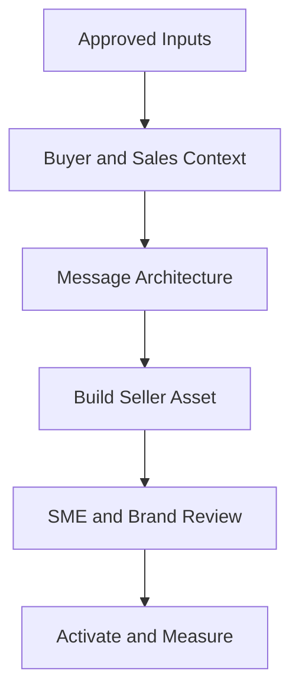

# Sales Enablement Content Builder

> An AI-assisted framework for transforming complex enterprise AI, cloud, cybersecurity, and SaaS capabilities into accurate, buyer-centered content that Sales can use.


## Why This Exists

Sales teams do not need more content; they need the right content for the buyer, account, and sales moment. This builder creates consistent messaging and practical seller assets while protecting accuracy, brand integrity, and human judgment.

## What It Demonstrates

- Product positioning and value-message translation
- Persona and buying-group messaging
- Sales playbooks, battlecards, discovery briefs, and objection handling
- Campaign-to-Sales handoff and follow-up workflows
- AI-assisted content development with governance controls
- Cross-functional alignment across Product Marketing, Demand Generation, Sales, Customer Success, and Partners

## Content Workflow



## Repository Contents

| Resource | Purpose |
|---|---|
| [`skills/sales-enablement-content-builder/SKILL.md`](skills/sales-enablement-content-builder/SKILL.md) | Claude-compatible workflow for creating seller-ready content |
| [`templates/persona-message-map.md`](templates/persona-message-map.md) | Buyer priorities, value, proof, objections, and calls to action |
| [`templates/competitive-battlecard.md`](templates/competitive-battlecard.md) | Evidence-based competitive positioning and talk tracks |
| [`templates/discovery-call-brief.md`](templates/discovery-call-brief.md) | Research, discovery questions, and meeting outcomes |
| [`templates/objection-handling-guide.md`](templates/objection-handling-guide.md) | Approved objection responses and validation requirements |
| [`templates/campaign-sales-handoff.md`](templates/campaign-sales-handoff.md) | Trigger, context, follow-up, ownership, and feedback loop |
| [`examples/sanitized-agentic-ai-example.md`](examples/sanitized-agentic-ai-example.md) | Fictional example for an enterprise agentic AI platform |

## Supported Deliverables

- Persona and buying-group message maps
- Value propositions and positioning summaries
- Competitive battlecards
- Discovery-call briefs and question banks
- Objection-handling guides
- Email and social outreach frameworks
- Event and campaign follow-up kits
- Executive briefs and talk tracks
- Customer expansion and cross-sell plays

## Example Prompt

```text
Use the Sales Enablement Content Builder to create a discovery-call brief and
persona message map for an enterprise agentic AI platform. The audience includes
the CIO, CAIO, Security, IT Operations, and Procurement. Separate verified claims
from assumptions, translate technical capabilities into business value, include
role-specific discovery questions, and flag every proof point requiring approval.
```

## Quality Standard

Every asset must be:

- Accurate and traceable to approved inputs
- Relevant to a defined buyer and sales stage
- Concise enough for real seller use
- Differentiated without unsupported competitor claims
- Clear about the next-best action
- Reviewed by an accountable human before publication

## Portfolio Note

This repository contains original, generalized frameworks and fictional examples. It does not include confidential customer information, proprietary messaging, or employer-owned sales materials.

## License

MIT License. See [`LICENSE`](LICENSE).
